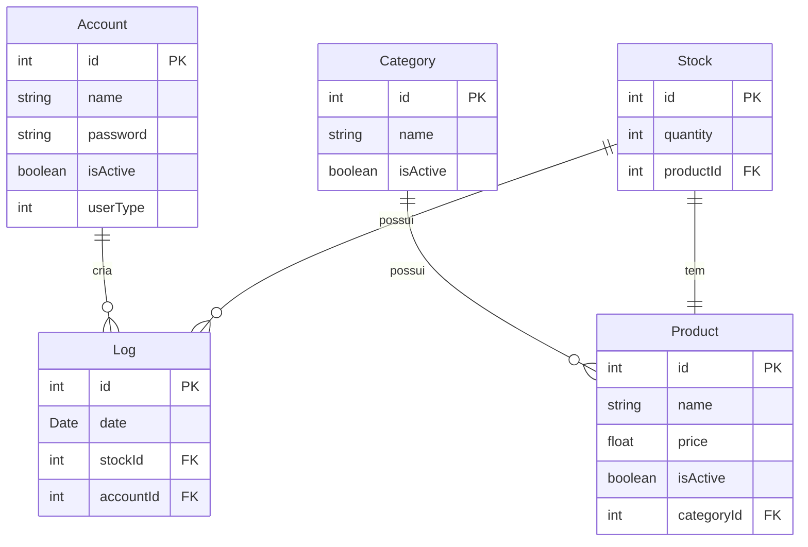

# Análise de Pontos de Função (APF)

A Análise de Pontos de Função (APF) permite medir o tamanho funcional do sistema, considerando as funcionalidades implementadas no projeto Sis Estoque.

## Visão Geral do Sistema

O Sis Estoque é um sistema de gerenciamento de estoques, desenvolvido com:

- **Backend**: NestJS (TypeScript)
- **Frontend**: Angular (TypeScript)

A estrutura do repositório indica uma separação clara entre o frontend e o backend, com pastas dedicadas para cada um.

## Contagem Indicativa

Na contagem indicativa, consideramos apenas as Funções de Dados:

- **ALI (Arquivo Lógico Interno)**: 35 PF cada
- **AIE (Arquivo de Interface Externa)**: 15 PF cada

### Modelo de Dados

### Tabela de Contagem Indicativa

| Função de Dado  | Entidades Relacionadas       | Tamanho em PF |
|-----------------|------------------------------|---------------|
| ALI Produto     | Produto, Categoria, Estoque  | 35 PF         |
| ALI Usuário     | Usuário, Log                 | 35 PF         |
| **Total**       |                              | **70 PF**     |

## Contagem Detalhada

A contagem detalhada considera as Funções de Dados e as Funções de Transação:

- **ALI (Arquivo Lógico Interno)**
- **AIE (Arquivo de Interface Externa)**
- **EE (Entrada Externa)**
- **CE (Consulta Externa)**
- **SE (Saída Externa)**

### Tabela de Contagem Detalhada

| Descrição            | Tipo | ALR | DER | Complexidade | Tamanho em PF |
|----------------------|------|-----|-----|--------------|---------------|
| ALI Produto          | ALI  | 3   | 5   | Média        | 7 PF          |
| ALI Usuário          | ALI  | 2   | 4   | Baixa        | 7 PF          |
| Inserir Produto      | EE   | 3   | 4   | Média        | 4 PF          |
| Atualizar Produto    | EE   | 3   | 4   | Média        | 4 PF          |
| Consultar Produto    | CE   | 3   | 4   | Média        | 4 PF          |
| Inserir Usuário      | EE   | 1   | 3   | Baixa        | 3 PF          |
| Atualizar Usuário    | EE   | 1   | 3   | Baixa        | 3 PF          |
| Consultar Usuário    | CE   | 1   | 3   | Baixa        | 3 PF          |
| Registrar Log        | EE   | 1   | 2   | Baixa        | 3 PF          |
| Consultar Log        | CE   | 1   | 2   | Baixa        | 3 PF          |
| **Total**            |      |     |     |              | **41 PF**     |

---