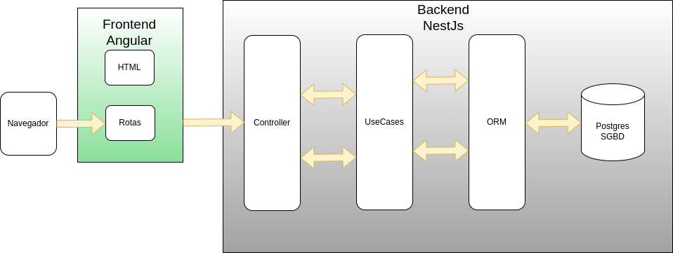

# Projeto Arquitetural do Software

## Descrição da Arquitetura do Projeto

O projeto será estruturado utilizando uma arquitetura cliente-servidor, onde o backend atuará como o servidor responsável por expor uma API RESTful para o frontend feito em Angular, que será o cliente que consome as informações do servidor. O backend estará encarregado da lógica de negócios, manipulação de dados, autenticação e comunicação com bancos de dados, enquanto o frontend será responsável pela interação com o usuário e a apresentação de dados.

A arquitetura pode ser considerada monolítica em termos de organização do código, já que toda a lógica de backend será gerenciada em uma única aplicação, mas será composta por módulos para promover a separação de responsabilidades. Embora o frontend e o backend sejam tecnicamente independentes, ambos estarão no mesmo repositório para facilitar o desenvolvimento.

## Visão Geral da Arquitetura

## Requisitos Não-Funcionais

Requisito  | Detalhes
---------- | -------------------------------------------- 
Desempenho | 1. A pesquisa por produtos no estoque deve retornar os resultados em até 2 segundos para uma lista de até 100 produtos.  2. As páginas que exibem o histórico de movimentações (compras e vendas) devem ser capazes de exibir até 500 registros por vez, com carregamento rápido (em menos de 4 segundos).  
Interoperabilidade | 1. Deve ser desenvolvido no sistema linux, criando uma imagem docker do sistema e com banco de dados PostgreSQL.

## Mecanismos arquiteturais

| Mecanismo de Análise | Mecanismo de Design  | Mecanismo de Implementação |
| -------------------- | -------------------- | -------------------------- |
| Persistência         | Banco de dados relacional | PostgreSQL 16       |
| Camada de Dados      | Mapeamento OR             | Prisma ORM            |
| Frontend  | Interface Usuário | Angular, HTML5, JS |
| Backend              | REST                  | ExpressJs     |
| Build                | Imagem Docker            | Docker e Dockerfile    |
| Deploy               | Container Docker         | Docker compose         |

# Referências

https://edisciplinas.usp.br/pluginfile.php/134335/mod_resource/content/1/Aula13_ArquiteturaSoftware_02_Documentacao.pdf

http://www.linhadecodigo.com.br/artigo/3343/como-documentar-a-arquitetura-de-software.aspx

http://diatinf.ifrn.edu.br/prof/lib/exe/fetch.php?media=user:1301182:disciplinas:arquitetura:exemplo-arquitetura-01.pdf
