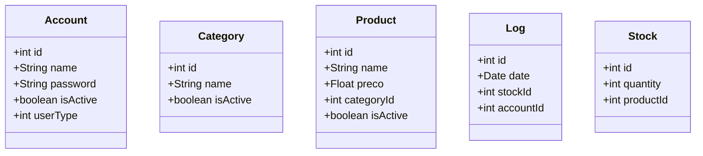
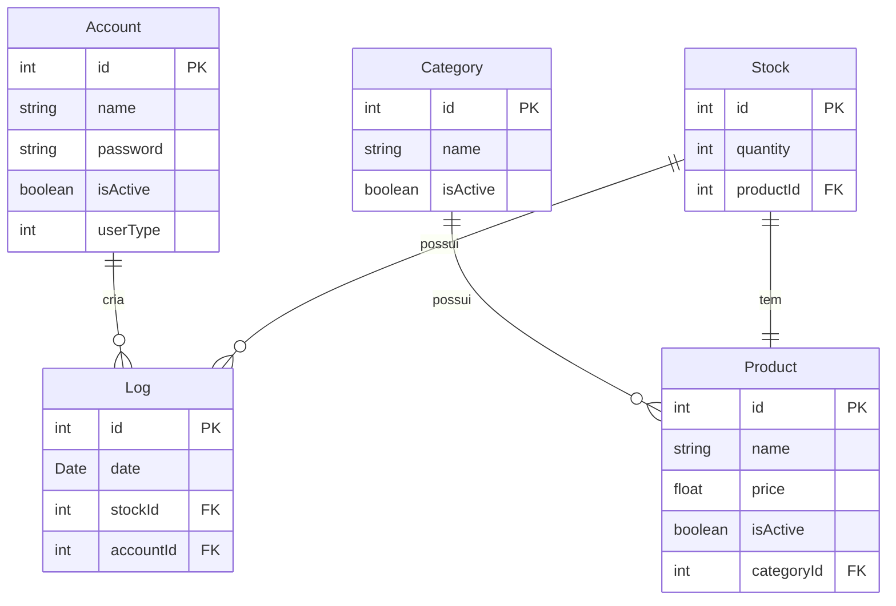

# Documento de Modelos

## Modelo Conceitual

### Diagrama de Classes usando Mermaid

### Descrição das Entidades

Descrição sucinta das entidades presentes no sistema.

| Entidade | Descrição   |
|----------|------------------------------------------------------------------------------------------------------------------------------------------------------|
| Usuário   | Entidade abstrata para representar informações gerais dos Usuários                                                  |
| Categoria   | Entidade abstrata para representar informações gerais das Categorias                                                  |
| Produto   | Entidade abstrata para representar informações gerais das Produtos                                                  |
| Log   | Entidade abstrata para representar informações gerais das Logs. Nele é possível buscar um log através de uma Data|
| Estoque   | Entidade abstrata para representar informações gerais dos Estoques. Nele é possível alterar ou diminuir a quantidade. |

## Modelo de Dados (Entidade-Relacionamento)

### Dicionário de Dados

|   Tabela   | Laboratório |
| ---------- | ----------- |
| Account  | Armazena as informações de um laboratório acadêmico. |
| Category | Armazena as categorias que serão utilizadas no relacionamento com os Produtos. |
| Product | Contém os diversos produtos presentes no sistmea. |
| Stock | Armazena as informações do estoque em si. |
| Log | Armazena os logs relacionados ao movimento de estoque. |

|  Nome         | Descrição                        | Tipo de Dado | Tamanho | Restrições de Domínio |
| ------------- | -------------------------------- | ------------ | ------- | --------------------- |
| id                 | identificador gerado pelo SGBD                | INT       | --     | PK / Identity |
| name               | nome da entidade                               | VARCHAR      | 30     | Not Null |
| password           | senha do usuário                              | VARCHAR      | 30     | Not Null |
| userType            | identificador do tipo da conta            | INT      | --     | Not Null |
| price              | preço do produto                              | FLOAT       | --     | Not Null |
| categoryId       | id da categoria relacionado        | INT       | --     | FK / Not Null |
| date  | data de movimentação do log                   | DATE         | --     | Not Null |
| stockId         | id do estoque relacionado              | INT       | 150    | FK / Not Null |
| quantity         | quantidade do estoque                         | INT          | --     | Not Null |
| productId         | id do produto relacionado          | INT       | --     | FK / Unique / Not Null |