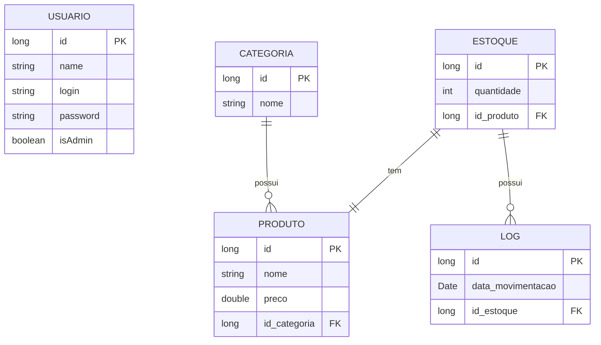

# Documento de Visão - Sis Estoque

## Descrição do Projeto

O projeto tem como base o controle de estoque simples, que poderia ser utilizado num mercado ou loja qualquer. Nesse sistema, os usuários podem realizar operaçõe CRUD - **C**reate, **R**ead, **U**pdate e **D**elete com as entidades Categoria, Produto, Estoque, Usuários e Log.

## Equipe e Definição de Papéis

Membro     |     Papel   |   E-mail   |
---------  | ----------- | ---------- |
João Pedro    | Tech Lead, Desenvolvedor  | jopesame@gmail.com
Diego Dantas     | Desenvolvedor | diegodantasjsrn@gmail.com
Emerson Silva         | Analista, Testador | emerson.santos.125@ufrn.edu.br
Reinaldo Alves      | Gerente, Desenvolvedor | reinaldo20jr@gmail.com 

### Matriz de Competências

Membro     |     Competências   |
---------  | ----------- |
João Pedro    | Java, Junit, Eclipse, Node, Angular, Typescript |
Diego Dantas  | Typescript, Angular, Markdown |
Emerson Silva | C, C++, Python, Latec, Markdown |
Reinaldo Alves| PowerBI, Machine Learning, Python |

## Perfis dos Usuários

O sistema poderá ser utilizado por apenas um usuário. 

Perfil                                 | Descrição   |
---------                              | ----------- |
Administrador | Este usuário realiza os cadastros de novos usuários e podem realizar qualquer função. 
Funcionário | Este usuário pode realizar funções com as entidades de Produtos, Estoque, Categorias e Logs. 

## Lista de Requisitos Funcionais

### Entidade Categoria - US01 - Manter Categoria
Uma categoria que será inclusa no Produto. Possui apenas um nome único e um identificador.

Requisito                     | Descrição   | Ator |
---------                     | ----------- | ---------- |
RF01.01 - Inserir Categoria      | Insere nova categoria informando nome. | Administrador |
RF01.02 - Listar Categorias      | Listagem dos centros utilizando filtros nos atributo: código, nome. | Administrador |
RF01.03 - Atualizar Categoria    | Atualiza uma categoria informando: nome | Administrador |
RF01.04 - Deletar Categoria      | Deleta uma categoria informando o código. | Administrador |

---

### Entidade Produto - US02 - Manter Produto
Um produto tem código, nome, categoria e preço.

Requisito                     | Descrição   | Ator           |
---------                     | ----------- | ----------     |
RF02.01 - Inserir Produto | Insere novo produto informando: código, nome, categoria e preço. | Administrador |
RF02.02 - Listar Produtos | Listagem de departamentos utilizando filtros nos atributos: código, nome, categoria e preço. | Administrador |
RF02.03 - Atualizar Produto | Atualiza um produto informando: nome, categoria e preço. | Administrador |
RF02.04 - Deletar Produto | Deleta um produto informando o código. | Administrador |

---

### Entidade Estoque - US03 - Manter Estoque
Um estoque tem o seu código único, produto relacionado e quantidade.

Requisito                     | Descrição   | Ator           |
---------                     | ----------- | ----------     |
RF03.01 - Inserir Estoque         | Insere novo estoque informando: produto, quantidade. | Administrador |
RF03.02 - Listar Estoques         | Listagem de estoques utilizando filtros nos atributos: produto, quantidade. | Administrador |
RF03.03 - Atualizar Estoque       | Atualiza um estoque informando: produto, quantidade e log. | Administrador |
RF03.04 - Deletar Estoque         | Deleta um estoque informando o código. | Administrador |

---

### Entidade Log - US04 - Manter Log
Um log tem o seu código único, estoque relacionado e data de movimentação.

Requisito                     | Descrição   | Ator           |
---------                     | ----------- | ----------     |
RF04.01 - Inserir Log         | Insere novo log informando: estoque relacionado e data de movimentação. | Administrador |
RF04.02 - Listar Logs         | Listagem de logs utilizando filtros nos atributos: estoque, data de movimentação. | Administrador |

---

### Entidade Usuário - US05 - Manter Usuário
Um usuário admnistrador tem código, nome, login e senha.

Requisito                     | Descrição   | Ator           |
---------                     | ----------- | ----------     |
RF05.01 - Inserir Usuário         | Insere novo usuário informando: nome, login e senha. | Administrador |
RF05.02 - Listar Usuário         | Listagem de usuários utilizando filtros nos atributos: código, nome. | Administrador |
RF05.03 - Atualizar Usuário       | Atualiza um usuário informando: nome, login e senha. | Administrador |
RF05.04 - Deletar Usuário         | Deleta um usuário informando o código. | Administrador |

---

### Modelo Conceitual

Abaixo apresentamos o modelo conceitual usando o **Mermaid**.

#### Descrição das Entidades
**Usuário** - Usuário que irá utilizar todo o sistema, de cabo a rabo.

**Produto** - Representa os produtos utilizados no sistema

**Categoria** - Representa as categorias utilizados no sistema. Essa entidade é essencial para a entidade dos Produtos.

**Estoque** - Entidade que controla a quantidade do estoque de cada produto.

**Log** - Funciona como um auxiliar para o Estoque, indicando cada movimentação que ocorreu por data e hora.

## Lista de Requisitos Não-Funcionais

Requisito                                 | Descrição   |
---------                                 | ----------- |
RNF001 - Deve ser acessível via navegador | Deve abrir perfeitamento no Firefox e no Chrome. |
RNF002 - Manutenibilidade | O código do sistema deve ser modular e bem documentado, para facilitar futuras manutenções ou modificações. |
RNF003 - Usabilidade | A interface do usuário deve ser intuitiva e fácil de usar, para que os operadores possam gerenciar o estoque rapidamente. |

## Riscos

Tabela com o mapeamento dos riscos do projeto, as possíveis soluções e os responsáveis.

Data | Risco | Prioridade | Responsável | Status | Providência/Solução |
------ | ------ | ------ | ------ | ------ | ------ |
15/04/2025 | Time não aprender ou demorar a aprender corretamente as tecnologias utilizadas no projeto | Alta | João Pedro | Vigente | Aulas, explicação de código e checagem semanal de como está o progresso do time em relação as tecnologias.
15/04/2025 | Time não realizar as tarefas determinadas pelo Tech Lead a cada iteração | Alta | João Pedro | Vigente | Utilização de ferramentas de agenda que motivem o time a focarem em suas respectivas tarefas
