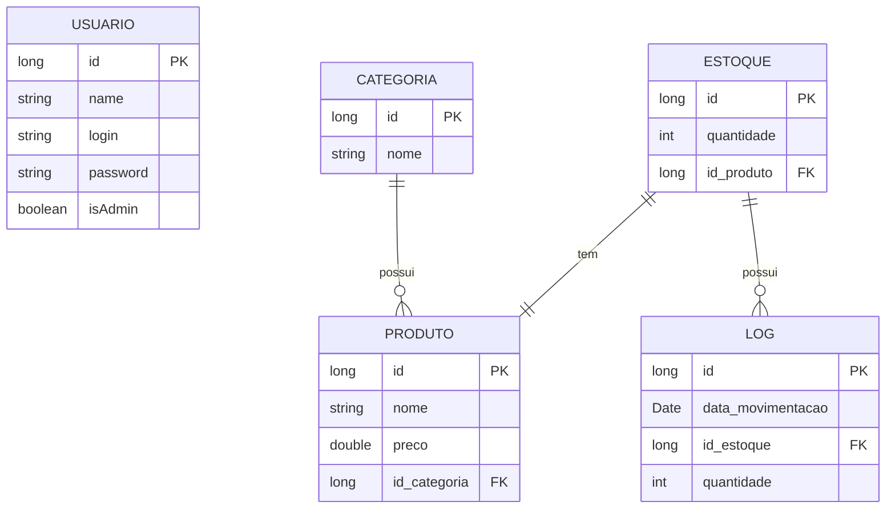

# Projeto 01

## Scripts
[Script para criação das tabelas](./create_script.sql)

[Script para povoamento das tabelas](./insert_script.sql)

## Modelo de dados utilizando Mermaid

```mermaid
erDiagram
    USUARIO {
        long id PK
        string name
        string login
        string password
        boolean isAdmin
    }

    CATEGORIA {
        long id PK
        string nome
    }

    PRODUTO {
        long id PK
        string nome
        double preco
        long id_categoria FK
    }
    CATEGORIA ||--o{ PRODUTO : "possui"

    LOG {
        long id PK
        Date data_movimentacao
        long id_estoque FK 
        int quantidade
    }

    ESTOQUE {
        long id PK
        int quantidade
        long id_produto FK
    }
    ESTOQUE ||--o{ LOG : "possui"
    ESTOQUE ||--|| PRODUTO : "tem"

```
